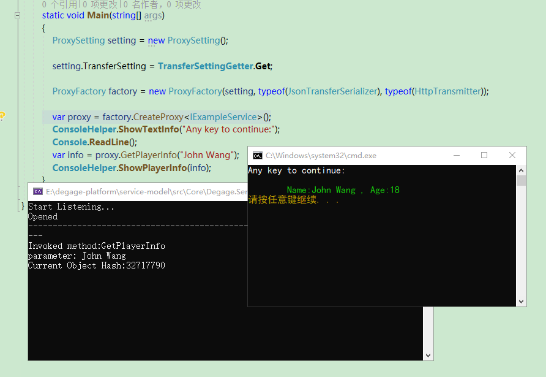

<p style="display:inline">
Hi,Every one.


## 服务模型-RPC ##

### v1.0(只做修复性维护)

这个版本更多的用于验证想法和技术的可行性，您可以在小型项目中使用它，或者在有能力维护它的情况下使用在中型项目。

在 .NET Fx 和  .NET Core 中您可以完整的使用它，但在 Mono 上，由于存在一部分尚未支持的 API，客户端的一些功能我们无法使用。

#### 目录

- [如何使用](#use)
- 传输器
- 序列化器
- 加密、压缩

  

##### 如何使用 <a id="use">  </a>

你可以在 [此处](https://github.com/degagetech/degage-platform-service-model/tree/master/src/Core/Degage.ServiceModel) 找到相应的示例代码

首先，我们可以定义一个接口，用于为服务双方提供一个统一的描述信息，这很重要。但是请注意，描述信息不一定只能从定义的接口上获得。

```c#
public interface IExampleService
{
    PlayerInfo GetPlayerInfo(String name);
    Boolean AddPlayerInfo(PlayerInfo info);
}
//相应的出现在接口中的类的定义
public class PlayerInfo
{
    public String Name { get; set; }
    public Int32 Age { get; set; }
}
```

接下来我们看看服务提供者这边需要如何设置：

```c#
HttpServiceHost host = new HttpServiceHost();

var setting = new TransferSetting
                {
                    Address = "http://127.0.0.1:20018/",
                    Timeout=new TimeSpan(0,0,15)
                };

host.Register(typeof(IExampleService), typeof(ExampleService));
host.Open(setting);

```

在服务端这边设置服务的地址，然后注册服务接口具体的行为类，最后调用 *Open* （请注意此函数不阻塞当前线程）打开即可。

而服务使用者那边呢？

首先我们需要先简单初始化代理工厂：

```c#
ProxySetting setting = new ProxySetting();
setting.TransferSetting =new TransferSetting
                {
                    Address = "http://127.0.0.1:20018/",
                    Timeout=new TimeSpan(0,0,15)
                };
 ProxyFactory factory = new ProxyFactory(
     setting, 
     typeof(JsonTransferSerializer),
     typeof(HttpTransmitter));
```

在代理工厂上设置相同的传输地址，这样才能保证访问到服务。

接下来，构造函数的 第二、三个参数，是为了数据的传输，当然你完全可以实现自己的序列化方式以及数据传输的方式。

然后通过代理工厂生成代理即可：

```c#
var proxy = factory.CreateProxy<IExampleService>();
```

最后我们调用相应的服务操作。

```c#
var info = proxy.GetPlayerInfo("John Wang");
```



------


### v2.0（积极开发的版本）


****
若有兴趣一起完善此框架，您可以通过TIM扫描下面的二维码，添加时请备注您最得意的开源项目的地址。

<p>

</p>